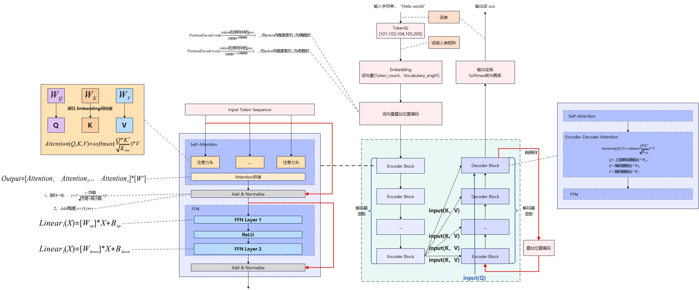

# [25.11.8]LLM模型训练计算过程

{:style="max-width:1200px;width:100%;"}

## 零、分词处理
词表有很多种方法可以生成，不同方法由于对词的切分、排序逻辑有差异，在词表长度、粒度、内容等方面均有差异，常见的拆分策略有按词、按字符、按子词。

词表中记录了编号ID和Token的对应关系，可以理解成一个字典，内容是每一个Token的内容和索引序号的映射关系，比如 a:1，b:2...。

词表的内容对于输入转换和后续训练十分重要。

## 一、输入处理
### 1.1 输入内容的tokenization

模型中的第一步是将人类世界中的文字序列转变为计算世界的输入，即将输入的字符串序列按词表拆分为Token，形成Token_id序列。

假定词表中有如下Token，`</w>`为分隔符，两个Token之间如果没有分隔符则会做为1个单词
- `he`->101
- `llo</w>`->102
- `wor`->104
- `ld</w>`->105
- `eos`->200，特殊token

输入替换为Token编号的过程实际就是查询词表，比如按照字词分词策略，“hello world”可能拆分为he-llo wor-ld的token序列。

对于拆分之后的token序列，按照词表可以映射成token的序号，并按需添加一些特殊token，形成[101,102,104,105,200]这样的token_id序列。

这些token_id序列可以根据词表decode成原始的词序列。

### 1.2 Token嵌入

输入内容序列在tokenization之后已经变成了token_id序列，Token嵌入会将Token_id序列中每个元素变成一个dim维（嵌入维度）的向量，即对于[101,102,104,105,200]这样长度为5的序列，会转换成5*dim的矩阵。

从token_id最终嵌入词向量会经过词嵌入和位置编码，两者加起来形成最终的嵌入向量：
#### 1.2.1 嵌入
token_id经过Embedding Layer嵌入层查表，转换为词嵌入向量，假设d为4，101->[1,2,3,4] (值是编的)
- Embedding计算实际上是把词表中所有的Token_id映射到d维向量空间中，在向量空间中表示各个Token之间的关系，**整个Embedding权重矩阵（嵌入矩阵）本质上就是一个可训练的token_id到嵌入向量的字典（查找表）**。
- 嵌入矩阵中的权重值会在训练过程中改变、调整，以使得语义有关联的token的词嵌入向量在嵌入空间的位置关系可以表达关联；
  - 初始状态下，嵌入矩阵中的值可以是随机的或者预设的；
  - 在训练中，损失函数对模型参数矩阵W、嵌入矩阵E分别求梯度，通过梯度下降同时更新嵌入矩阵和参数矩阵；
  - 嵌入矩阵在训练中确定，在推理中只需要对每个Token_id查询即可，不需要重复计算；
    - 输入矩阵：对于输入的n个Token的token_id，假设词表长度为m，可以生成一个输入的`n*m`矩阵，矩阵中行向量表示1个Token，向量中Token在词表中对应位置数值为1，其余为位置数值为0。通过输入矩阵中每行中数值为1的元素选中权重矩阵中的对应行，即输出结果中的每一行对应token的d维词嵌入向量。
- 权重矩阵中只有token对应行的数值会被调整，其余部分无法计算梯度，不会被更新。

Embedding权重矩阵则为`m*dim`的矩阵，即词表中每个Token对矩阵中的一行维度为dim的向量。

#### 1.2.2 位置编码
token_id在整个序列中的位置经过计算生成向量来标识位置，通常使用正弦、余弦来编码的，比如旋转位置编码，位置0->{0.1,0.1,0.1,0.1} (值也是编的)

## 二、Transformer
### 2.1 Transformer架构
Transformer中由多个Encoder和Decoder层结构叠加，每层成为一个Block组成，输入的Token矩阵会依次被每个Encoder处理，之后再被Decoder逐层处理。

这里说的只是Attention论文中的设计，是Transformer的基础框架。各种大模型在结构层面可能调整，可能只有Encoder或者只有Decoder，Decoder-Only的模型缺少Encoder的输出，交叉Attention无法计算，Decoder中交叉注意力计算步骤可能省去或者改变。此外，Encoder和Decoder之间的连接关系也可能发生变化。

### 2.2 Encoder Block
**以下是1个编码器Block**
#### 2.2.1 多头自注意力
注意力头中存在三种权重矩阵，分别是$W_Q、W_K、W_V$，本质上QKV是注意力机制捕捉特征关系的手段，有一种方便理解的解释：
- $W_Q$描述特征关系;
- $W_K$描述token的性质，Q、K相乘可获得每个Token与其他Token的方向一致性(匹配程度)，相关性较高的Token之间的点积相对较大；
- 点积数值的相对关系相比数值本身更加重要，所以使用softmax操作将值变为0~1之间概率，一个Token相对其他Token的所有数值之和为1；

对于输入张量`batch_size*input_token_length*embedding_dim`，每个样本$X_i$为`input_token_length*embedding_dim`的矩阵，计算方式如下：

1. 计算Q、K、V矩阵，每个注意力头均会处理整个输入矩阵

$$ Q=X_i * W_Q $$
$$ K=X_i * W_K $$
$$ V=X_i * W_V $$
其中，$W_Q$矩阵形状为 `embedding_dim*hidden_dim`，通常`hidden_dim`相比`embedding_dim`小很多。

每个token计算之后对应一个维度为`hidden_dim`的向量，`hidden_dim = embedding_dim\num_heads`，多个注意力头处理后多个向量拼接后形成最终向量，维度上为`embedding_dim`。

实际上，多个注意力头的权重矩阵会存储在一个大矩阵中，形状为`embedding_dim * embdding_dim`，每个注意力头都是一个切片。

$W_V$权重矩阵比较大，形状为`embedding_dim * embedding_dim`，参数比较多。

为了优化$W_V$权重矩阵的参数量，通常将其分解成两个矩阵，$W_V = V_{up} * $V_{down}$，通过两个小矩阵相乘来优化存储空间。

形状为`hidden_dim*embedding_dim`的$V_{up}$矩阵被当做$W_V$，而所有注意力头的$V_{down}$被整合在一起称作**输出矩阵**。

2. 自注意力计算

标准注意力机制中，每个注意力头分别计算自注意力。

**本质上，注意力计算的过程中，$Q*K^T$计算了在当前注意力头的关注的特征维度上，每个Token和所有Token的关联关系**。

$$Attention(Q,K,V)=softmax(\frac{Q*K^T}{\sqrt{K_{dim}}})*V$$

其中，$K_{dim}$为K向量的维度。

softmax计算方式：
$$ P_i = \frac{e^{V_i}}{\sum_{0}^{n}{e^{V_j}}} $$
其中，V_i为i位置的数值。

最终，多头注意力输出为多个注意力头的注意力结果拼接，再通过线性变化得到，即

$$Output=[\begin{matrix} Attention_1 & Attention_2... & Attention_n \end{matrix}]*[\begin{matrix}W^o\end{matrix}]$$

标准注意力机制中，每个注意力头有独立计算Q、K、V矩阵，消耗大量的算力和KV Cache空间，针对这个问题业界有不同的注意力计算优化策略：
- 多查询注意力（Multi-Query Attention，MQA）：让多个注意力头共享K、V矩阵，每个注意力头分别拥有自己的Q；
- 分组注意力查询(Grouped Query Attention，GQA)：注意力头分为若干组，每组内注意力头共享一套K、V，但是每个注意力头分别有自己的Q；
- 可以在训练中采用标准注意力机制(MHA)，然后将MHA的K、V转换成MQA或者GQA的K、V(可以求平均转换或者对原有模型蒸馏)，在推理中使用MQA或者GQA来提升推理效率；
- 环注意力机制：coconut-mode.comm/posts/ring-attention

#### 2.2.2 注意力残差与归一化
残差连接通常用于避免多层网络表达能力下降的问题，多头注意力输出会与输入叠加，再进行归一化。

残差计算方式为： $output = X + f(X)$
层归一化计算方式为：
$$LayerNorm = \eta * \frac{X_i * 均值}{\sqrt{方差 + 极小值}} * \beta$$

其中$\eta$和$\beta$均可以训练调整。

归一化处理有不同的策略，上面归一化策略为后归一化，即在处理之后进行归一化。另一个中策略是预归一化，即先归一化再进入子层，GPT通常选择预归一化策略。
- 预归一化处理策略（Pre-LayerNorm）：
  - -->**输入X层归一化** 
  - --> 多头注意力计算 
  - --> 残差连接$X=X+Attention(LN(X))$ 
  - --> **输入X层归一化** 
  - --> 前馈神经网络 
  - --> 残差连接$X=X+FFN(LN(X))$
- 后归一化处理策略（Post-LayerNorm）：
  - --> 多头注意力计算 
  - --> 残差连接和归一化$X=LN（X+Attention(X)）$ 
  - --> 前馈神经网络 
  - --> 残差连接和归一化$X=LN（X+FFN(X)）$

#### 2.2.3 前馈神经网络
前馈神经网络FFN是两个线性变换，中间有一个激活函数，通常是ReLU或者GELU。

$$Linear_1(X)=[W_{up}]*X + B_{up}$$
其中$B_{up}$为偏置向量，第一个线性变化$Linear_1(X)$将输入从hidden_dim扩大到intermediate_size，通常是扩大到原本的4倍。

$$X = Linear_2(ReLU(Linear_1(X)))+X$$
其中，ReLU是下线性整流函数的缩写，其实就是负值归0，正值不变。

$$Linear_2(X)=[W_{down}]*X + B_{down}$$
第二个线性变换将维度缩小回hidden_dim。

**FFN的这两个线性层的参数量占到了整个LLM参数量的$\frac{{2}}{3}$，模型学习到的知识可看做大部分上存储在FFN参数中。**

##### 2.2.3.1 MOE机制
大模型中，FFN的参数量占到整个模型参数的大部分，以GPY为例1160亿/1750亿=66%，这些参数承载了大模型对事实的存储。

这么大的参数量，如果在推理过程中只激活部分参数，就可以大幅提升效率。
MOE就是解决这个问题，每次仅仅激活部分专家，而不是激活所有参数。

所谓的专家存在于前馈神经网络中，专家并不擅长某一个专业领域，而是擅长处理某种Token。
每层FFN都有多个专家，每层有router选择专家，可以选择不同的专家。
Router选择专家的时候可以有不同的策略，比如同时选择多个再综合输出，或者固定选择一些专家的基础上再根据策略选择其他专家。

#### 2.2.4 残差与归一化
前馈神经网络FFN之后，会再次进行残差计算和层归一化，过程与前文一致。

**上述步骤为Transformer中1个Encoder Block的处理逻辑**

### 2.3 Decoder Block
解码器由自注意力、交叉注意力和FFN组成，相比编码器多了交叉注意力。

交叉注意力的计算过程与自注意力计算逻辑一致，不同的是，K、V由编码器计算得出作为输入，Q矩阵由解码器自身计算得出作为输入。

## 三、输出层
输出层将编码器的输出转化成最终输出，基本是两个过程，一是线性变换，二是Softmax计算概率，并根据概率在词表中选择最终的输出Token。

Softmax中，为了避免每次输出相同Token，同时权衡输出的准确性和多样性，计算过程中引入了Temperature，具体计算方式如下：

$$ P_i = \frac{e^{\frac{V_i}{Temperature}}}{\sum_{0}^{n}{e^{\frac{V_i}{Temperature}}}} $$

- 当Temperature=1时，就是标准的softmax函数。
- 当Temperature>1时，会平滑概率分布，使得模型更倾向于选择非最高概率的token，增加多样性。
- 当Temperature<1时，会锐化概率分布，使得模型更倾向于选择最高概率的token，减少多样性。

## 四、训练
### 4.1 前置概念
明确当前训练中一些概念：
- Epoch，轮次，也就是说整个训练数据集中的每个训练样本都通过了模型一次，即数据集有10K个样本，在Epoch中10K个样本都在模型中训练了1次；
- Batch或者mini-batch，批，一个Epoch中的数量往往会很大，无法一次性将所有样本输入模型，只能将样本分批输入，每批包含batch_size个样本，这样的一批就是Batch；
  - 比如Epoch中有10K样本，每个batch可以输入50个样本，这样这个Epoch会分为200个Batch；
  - 通常，一个训练数据集的不同epoch对batch的划分不固定，epoch会对数据进行shuffle，或者按照策略重新划分，即不同的epoch中同序号的batch包含的样本完全不一样，或者不完全一样；
    - 训练过程中数据的shuffle可以有效避免模型学习到样本出现的固定模式，防止模型过拟合；
- Iteration，迭代，每完成一个batch的训练成为一次iteration

参数更新（Embedding权重举证和模型参数矩阵）的时机可以有不同的策略：
- 每个样本处理完更新参数，更新的频率会很高，由于下一个样本的处理以来于本次样本的参数更新，样本的处理只能串行，整体训练速度会慢，且更新的方向完全受单个样本影响，不稳定；
- epoch结束时，对所有样本的更新求均值更新参数，这样在更新之前需要存储所有样本的更新，内存需求大，但是更新的方向会比较稳定；
- batch结束时，对batch中的所有样本产生的参数更新取均值更新参数，这样平衡了按照样本粒度更新和按照epoch粒度更新，当前通常是采用这种策略；

### 4.2 训练过程
对于1个batch的输入，在转换为嵌入词向量并叠加位置编码之后，最终生成形状为`batch_size*input_token_length*embedding_dim`的张量。

Batch中每个样本的Token序列会并行训练，也就是说对于一个样本的Token序列，所有位置会并行计算输出，然后反向传播调整模型参数。

Token序列并行时，会输入整个Token序列并行计算所有注意力，同时使用掩码机制遮挡后续Token相关信息，使得每个位置的Token在训练中只能关注其前序Token，通过这种方式并行计算所有位置的输出，并进行参数调整。
- 一次性将样本的整个Token序列输入模型；
- 通过矩阵运算，同时计算所有token的Query、Key、Value；
- 对每个位置设置后续信息掩码，并行计算所有位置的注意力输出；
  - 因果掩码，Causal Mask，本质上就是遮挡矩阵上三角，将矩阵变为下三角矩阵；
- 同时通过前馈网络得到所有位置的输出；

**可并行训练是Transformer架构的核心创新点之一，这使得Transformer模型在训练过程中可以通过并行样本Token序列的每个位置，极大的提升时间效率。**

反观RNN，在训练过程中，输出第N+1个Token的训练依赖第N个Token和上一时间步的隐藏状态，其中隐藏状态持续更新，用于编码前序Token序列的信息。训练过程中轮次间的隐藏状态依赖，造成了时间上的强制约束，导致RNN只能顺序训练，无法通过并行的方式加速训练过程。

