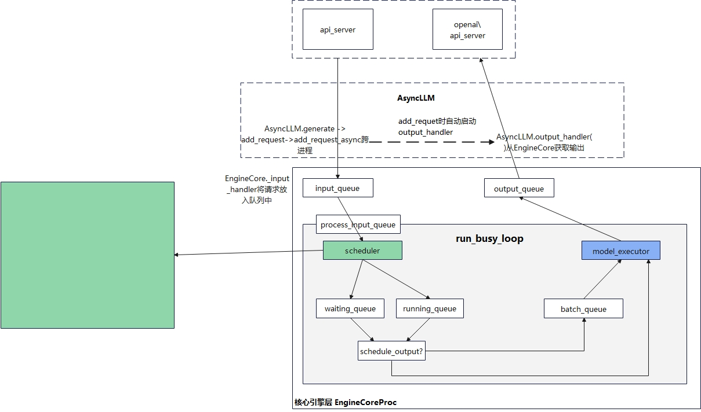

# [26.02.19] vlllm推理框架
在大模型推理场景中，自注意力计算过程中，第N+1个Token的自注意力需要用前N个Token的K、V计算，因此前序Token的K、V会被缓存下来，用于在下一轮的自注意力计算中避免重复计算。

自注意力矩阵描述了当前Token与序列中已经出现的各个Token之间的关联关系，每一轮次的注意力矩阵不会被下一轮次的推理复用。


vLLM提供了2个api_server文件，entrypoints下的api_server文件提供了测试版本的推理api入口(generate)，openai\api_server提供了兼容openai的推理api入口。

2个spi_server分别对应了2种推理模式：离线推理、在线推理。
- 离线推理主要用于在一次性处理大量数据时获得最优的吞吐量，最终推理结果一次性返回给用户；
- 在线推理主要用于多个请求并发的在线推理服务中，推理结果逐步产生并发回给用户，可以获得较好的服务体验；




vLLM的架构
1、API_Server：注册API处理方法，接收客户端API请求；

2、AsyncLLM：
- 请求处理，Tokenize，组装EngineCoreRequest；
- add_rquest，通知EngineCoreProc请求到来，需要加入队列中；
 
3、EngineCoreProc
- process_input_socket监听到来的请求，加入input_queue中；
- EngineCoreRequest加入到scheduler的waiting队列中；
- Scheduler从waiting、running队列中选择请求进行推理；
- 推理结果output加入output_queue中；
- output_queue中的推理结果被process_output_socket()发送到AsyncLLM

LLMEngine为vllm的部署副本，每个LLMEngine中有1个Scheduler和1个Executor。
在V1架构中，Scheduler和Executor均位于EngineCoreProc进程中，每个Executor管理若干个Worker，每个Worker管理一张卡；
**LLMEngine之间是完全独立的，互不通信** --> **编排调度层(路由层)决定了请求由哪个LLMEngine处理**
- 随机路由时，一个用户的请求序列，如果路由到了没有前序KV Cache的LLMEngine上时，之前的KV需要重新计算；
- 粘性路由时，用户的请求会有固定策略选择LLMEngine，但是不同Engine之间可能会有负载不均衡的问题；
- 分布式缓存方案下，建立分级缓存，根据缓存路由，并搬移缓存避免Engine负载不均衡，如Mooncake

- 引擎层
  - Input Processing: 处理输入请求，例如用 tokenizer 进行输入处理
  - Scheduling： 处理请求的调度，每一个 Step 执行哪些请求
  - ModelExecution： 执行请求
  - Output Processing： 处理输出，将大模型的输出转换为可读的语言


LLM Executor提供模型处理任务统一模型，用于连接上层LLM Engine和下层Worker;
- 4种类型的Executor：
  - mp：适用于单机多卡，executor是主进程，workers为子进程；
  - ray：适用于多机多卡，Executor成为一个ray driver process，其下管控着若干worker process；
  - uni：适用于单卡；
  - external_launcher，适用于使用外部工具做分布式管理，如Slurm，

LLM Worker是运行推理的核心进程，vLLM使用单个进程来控制单个加速器设备（即一个Worker对应一张卡），所有的Worker都由Executor统一管理。

Model Runner负责加载模型并运行推理过程，维护者模型权重、分片等信息；
- Model实际想是PyTorch的模型实例；
- KV Cache是卡上存的KV

### Executor、Worker通信
```
Executor -- 输入数据 --> Worker
Worker -- 推理结果 --> Executor
```

Executor和Worker之间存在2种进程间通信机制。
- <=10MB的小数据，使用hmRingBuffer(共享内存环形缓存)传输，避免复制数据和网络协议中开销
- >10MB的数据，使用ZMQ Socket传输


KV Cache管理
每块卡上可分配给kv cache的显存 = 该卡总显存 * 用户设置的显存利用率 - 推理过程中的峰值显存。
- 其中推理可通过模拟进行

最小粒度是Token，一个Token的大小是token_size，包含了Token多个注意力头的K、V，每个K、V元素的大小会受到float16、int8类型的影响；

一个Block中可容纳block_size个Token，成为page；

一个Tensor中有多个Block；

在vllm中block table用于完成虚拟地址(逻辑块)到实际地址(物理块)的转换；
- 逻辑块与物理块的映射关系；
- 每个物理块被填满的槽位

在prefill阶段，按照prompt的长度分配block，block中的Token位置可能会有剩余，block中剩余的位置称为保留位；
Decode阶段，block的槽位持续被token填充，位置不足时，新的block会申请、分配；

当不同请求prompt中token序列相同时，不同的逻辑块可以复用相同的物理块，直到出现不同的token时(无法复用)再copy-on-write；

当GPU显存不足时，vllm需要按照策略选择一部分KV Cache的block释放掉，这些block的KV内存会交换到CPU内存上，显存充足时再加载回来；
