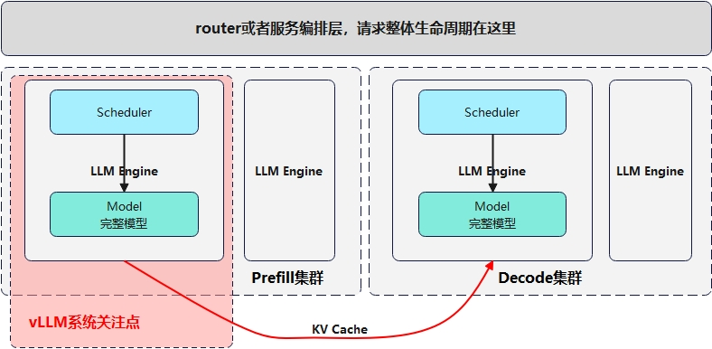
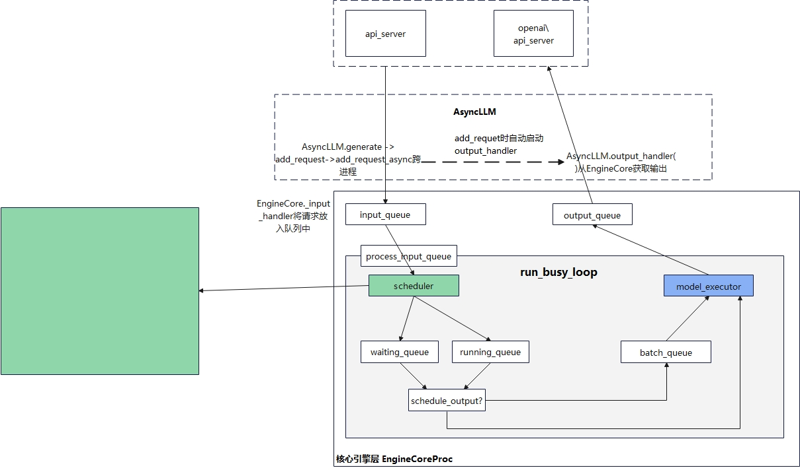

# [26.02.19] vlllm推理框架

在大模型推理场景中，自注意力矩阵描述了当前Token与序列中已经出现的各个Token之间的关联关系，每一轮次的注意力矩阵不会被下一轮次的推理复用。

**但是，自注意力计算过程，第N+1个Token的自注意力需要用前N个Token的K、V计算。因此前序Token的K、V会被缓存下来，用于在下一轮的自注意力计算中，避免重复计算。**

如何更多的使用缓存，在计算注意力的过程中使用缓存避免计算，就是推理过程中的核心问题，基本上所有llm推理引擎都是在回答这个问题。


## 1、vllm的关注点

**LLMEngine为vllm的部署副本，每个LLMEngine中有1个Scheduler和1个Executor。**

**LLMEngine之间是完全独立的，互不通信。vllm主要关注LLMEngine内部。**

**多个LLMEngine如何协同获得更大吞吐由编排调度层搞定，编排调度层(路由层)决定了请求由哪个LLMEngine处理。**
- 随机路由时，一个用户的请求序列，如果路由到了没有前序KV Cache的LLMEngine上时，之前的KV需要重新计算；
- 粘性路由时，用户的请求会有固定策略选择LLMEngine，但是不同Engine之间可能会有负载不均衡的问题；
- 分布式缓存方案下，建立分级缓存，根据缓存路由，并搬移缓存避免Engine负载不均衡，如Mooncake；

## 2、vllm架构


vLLM的架构分为以下层次
1. API层，API_Server注册API处理方法，接收客户端API请求；
2. AsyncLLM连接了API层与引擎层，做了推理前置工作。
- 请求处理，Tokenize，组装EngineCoreRequest；
- add_rquest，通知EngineCoreProc请求到来，需要加入队列中；
3. 核心引擎层，EngineCoreProc，Scheduler和Executor均位于EngineCoreProc进程中，每个Executor管理若干个Worker，每个Worker管理一张卡；

LLM Executor提供模型处理任务统一模型，连接上层LLM Engine和下层Worker，用于分发调度请求到各个Worker上执行推理；
- 4种类型的Executor：
  - mp：适用于单机多卡，executor是主进程，workers为子进程；
  - ray：适用于多机多卡，Executor成为一个ray driver process，其下管控着若干worker process；
  - uni：适用于单卡；
  - external_launcher，适用于使用外部工具做分布式管理，如Slurm，

4. 执行层
LLM Worker是运行推理的核心进程，vLLM使用单个进程来控制单个加速器设备（即一个Worker对应一张卡），所有的Worker都由Executor统一管理。
每个Worker中有两个实例，CacheEngine和model_runner
- CacheEngine管理设备(CPU或者GPU)上的KV Cache物理块；
- model_runner加载模型并执行推理

## 3、vllm关键流程

### 3.1 整体流程

1. vLLM提供了2个api_server文件，entrypoints下的api_server文件提供了测试版本的推理api入口(generate)，openai\api_server提供了兼容openai的推理api入口。
2个api_server提供了2种推理模式：离线推理、在线推理。
- 离线推理主要用于在一次性处理大量数据时获得最优的吞吐量，最终批量推理结果一次性返回给用户；
- 在线推理主要用于多个请求并发的在线推理服务中，推理结果逐步产生并发回给用户，可以获得较好的服务体验；

2. process_input_socket监听到来的API请求，加入input_queue，流转后，EngineCoreRequest加入到scheduler的waiting队列中；

3. Scheduler从waiting、running、swapped队列中选择请求，并调用Executor进行推理
- 每个请求都是一个step，1个prefil是1个step，每个decode生成1个Token也是1个step；

4. Executor通过各个Worker执行推理操作，推理结果output加入output_queue中；
```Executor、Worker通信
Executor -- 输入数据 --> Worker
Worker -- 推理结果 --> Executor
```
Executor和Worker之间存在2种进程间通信机制。
- `<=10MB的小数据，使用hmRingBuffer(共享内存环形缓存)传输，避免复制数据和网络协议中开销`
- `>10MB的数据，使用ZMQ Socket传输`

5. output_queue中的推理结果被process_output_socket()发送到AsyncLLM；

### 3.2 调度器
**调度器的最根本的职责就是选择被推理的请求，同时解决请求的KV cache分配问题。vllm中所有调度策略都是围绕这一点展开。**

当前，vllm的调度策略可以总结为：**先开先处理，后来先抢占**

1. EngineCoreProc中会启动run_budy_loop()的死循环，将input_queue中的请求加入Scheduler的waiting队列；
- add_request()，将1个prompt包装为sequenceGroup，并加入调度器的waiting队列中；
  - sequenceGroup对象承载1个prompt到N个output，每个prompt到output组成一个Sequence实例，每个Sequence有单独的状态可以控制(等待、换入换出、结束等)

2. Scheduler从waiting、running、swapped队列中选择被处理的请求；
- 在调度过程中，以需要计算的Token为粒度进行调度，对于prefill来说，prompt可能包含多个Token需要计算，而decode仅包含1个Token需要计算。
- 一旦prompt中有Token进入调度，请求就从waiting队列进入running队列，而在后续过程中调度器会优先调度running队列中的请求，有余力再调度waiting队列中的请求。
- 后来先抢占策略：如果没有足够的block，running队列末尾的请求可能被强占，并释放其占用的block；

3. Scheduler选择被调度的请求，包装为ShedulerOutputs，并传递给Executor执行。
- _run_engine()执行推理，实际上调用LLMEngine的step()完成1次推理
  - 由于prefill和decode的算子逻辑有显著差异，一个轮次中混合prefill和decode会出现算子相互干扰；
  - 在早期调度中，一次调度选中的所有请求，所有SequenceGroup要么全部处于prefill阶段，要么全部处于decode阶段；**当前版本已改(Chunked Prefill)，可以混合调度**
  - 也就是说，一旦选中waiting队列(prefill)，则需要停下running、swapped队列中decode请求的处理

### 3.3 模型加载
Model Runner负责加载模型并运行推理过程，维护着模型权重、分片等信息；
- Model实际上是PyTorch的模型实例；
- KV Cache是卡上存的KV

Executor -> Worker.load_model() -> ModelRunner.load_model()
1、model_executor\models\registry.py中注册了vllm支持的模型名称与模型加载类之间的映射关系，同目录下有模型的加载类，类中实例了如何加载模型参数；
2、ModelRunner.load_model()解析需要加载的模型名，使用相应模型加载类中实现的方法加载模型；

### 3.4 KV Cache管理

每块卡上可分配给kv cache的显存 = 该卡总显存 * 用户设置的显存利用率 - 推理过程中的峰值显存。
- 其中推理过程的峰值显存，可通过模拟来获得数值

Cache的最小粒度是Token，一个Token的大小是token_size，包含了Token多个注意力头的K、V，每个K、V元素的大小会受到float16、int8类型的影响。

一个Block中可容纳block_size个Token，称为page；

一个Tensor中有多个Block；

在vllm中block table用于完成虚拟地址(逻辑块)到实际地址(物理块)的转换；
- 逻辑块与物理块的映射关系；
- 每个物理块被填满的槽位；

在prefill阶段，按照prompt的长度分配block，block中的Token位置可能会有剩余，block中剩余的位置称为保留位；
Decode阶段，block的槽位持续被token填充，位置不足时，新的block会申请、分配；

当不同请求prompt中token序列相同时，不同的逻辑块可以复用相同的物理块(要求前序Token序列完全相同)，直到出现不同的token时(无法复用)再copy-on-write；

当GPU显存不足时，vllm需要按照策略选择一部分KV Cache的block释放掉，这些block的KV内存会交换到CPU内存上，显存充足时再加载回来；
