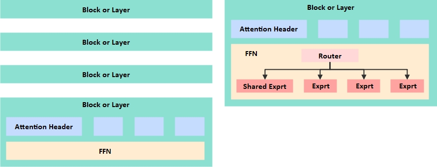
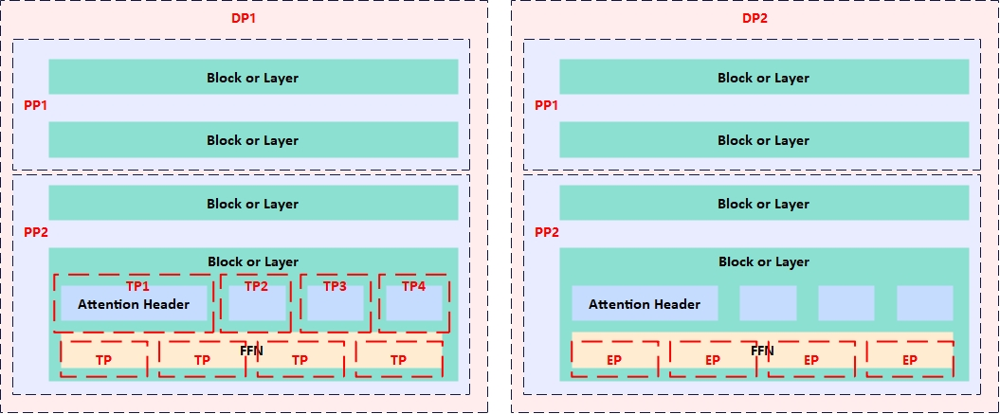
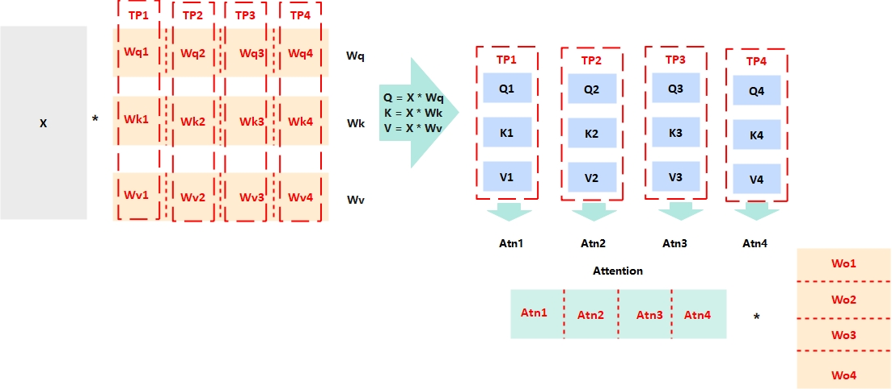
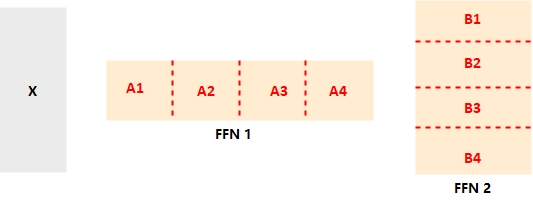
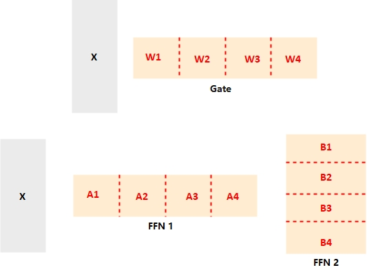

# [25.12.06] 分布式训练、推理

图中为简化版的模型构成，模型参数的持续增加，导致单卡、单机的空间无法承载模型参数所需的空间，同时也无法接受模型逐个样本串行训练所消耗的时间。

为了解决上述问题，大家尝试在大模型训练中引入分布式技术，通过将模型拆分、部署在更大范围的硬件资源上，以更大的资源规模解决模型参数承载问题和训练时间问题。

分布式技术的引入使得原本以整体存在的模型分散到了不同的资源上，数据交互从单卡、单机扩散到了多卡、多机甚至多柜，通信开销成为不得不考虑的问题。

综合考虑模型特点、拆分代价、训练效率，可以按数据并行、流水线并行、张量并行等方式进行分布式化。

由于模型训练和模型推理的系统目标存在差异，同一个模型在训练和推理的过程中分布式拆分的策略可能存在显著差异。

## 一、数据并行 DP

待训练模型通过在大量样本上进行学习来改变模型参数，最终实现对模型的训练。

但是，部署一份待训练模型，让训练样本逐一通过模型，会有两个问题：
- 其一，模型副本单一，样本只能串行训练，时间无法接受；
- 其二，模型参数的改变极易受到单个样本数据的影响而改变，可能无法收敛；

由此，数据并行被引入到分布式训练中，核心思想是“模型复制，数据切分”，即完整的模型被部署到多个副本上，Batch中的样本被切分为多个分片，被多个模型副本并行处理，大幅减少训练时长。

在一次Batch处理中，模型的多个副本处理不同分片的样本，导致模型参数改变方向不同，参数值有差异。

因此，每次Batch处理结束后，各个模型副本的参数调整需要归一，多个副本之间需要交换模型参数并进行更新，之后才能进行下一个Batch的训练。

通常，batch中的所有样本产生的参数更新取均值更新模型参数，这样同时解决了模型参数受单一样本影响过大的问题。

## 二、流水线并行 PP

模型参数量的规模越来越大，无法在1个GPU或NPU中被完整存储，模型被迫切分都到多张卡或多台服务器上，由此产生了流水线并行技术。

现在大模型采用的Transformer架构，模型中编码器、解码器会分为多层，样本Token会逐个流过每个Layer。

因此，将模型按照Layer切分Stage，将不同Stage部署到不同资源上，各个Stage按照流水线的方式处理样本Token，实现效率提升。

Stage之间，传递的数据是激活值及状态(前向传播)、激活值梯度(反向传播)。

在流水线并行中，由于数据传递存在依赖，即后面的Stage依赖前面Stage的输出，所以流水线Stage中会存在空闲等等时间(流水线气泡)，业界有很多技术来优化流水线，比如1F1B，通过减少缓存激活值降低显存使用，batch切分为更多的micro-batch，最终减少气泡。

## 三、张量并行 TP

模型参数矩阵过大，导致矩阵计算量由单卡承载计算耗时太长，TP通过把计算拆分到多个计算设备上并行计算实现加速，用资源规模换时间。
- 实际上，单独看模型层的显存占用量，单显卡是可以轻松放下模型的一层的；
  - 对于隐藏层维度为20480的模型，单层升维矩阵参数为`20480*4*20480`，大约为1.67B，需要3.3GB显存；
  - 其次，中间激活值和Attention的Q、K、V副本会占用10GB以上显存，**对于X很大的场景，如Batch为32，SeqLen为128K，隐层为20480，输入的数据量为32*128K*20480*2B = 160GB，必须拆分到多个TP才能放下**；
  - 除此之外，优化器状态可以占到模型参数8倍，需要26.4GB显存；
- 对于一层模型，Y=X·W，X的形状为[Batch，SeqLen， Hidden]，W形状为[Hidden， Hidden]，需要`B*S*H*2H`次乘加运算，Batch为32，SeqLen为128K，隐藏层维度为20480，计算量超3200TFlops，对于H100显卡也需要几秒才能完成计算；
- 在计算之前，需要将W矩阵从显存搬运到缓存中，数据量为`2*H*H`，因此

对于Attention的计算来说，按注意力头拆分QKV，即Wq、Wk、Wv矩阵按列拆分，不同TP计算得到Q、K、V，在内部可以完成注意力计算，得到的注意力天然按列切分。

Wo矩阵按行切分，可以最小化通信量。

对于FFM，FFN1矩阵按列切分，FFN2矩阵按行切分，计算结果：
$$
A*B = A_1 * B_1 + A_2 * B_2 + A_3 * B_3 + A_4 * B_4
$$

### 3.1 专家并行

上面所说的模型都是稠密的，即对于输入的每一个Token，都需要模型的所有参数参与计算，这对大模型来说是及其浪费和不必要的。

混合专家技术通过把FFN分为多个专家，对于一个Token来说，只交给部分专家处理，其余专家不参与计算，这样模型只要激活部分参数，即稀疏模型。

混合专家引入了Gate，以决定每个Token由哪些专家处理，整体计算公式为：
$$
Y = (\text{SiLU}(X \cdot W_{gate}) \odot (X \cdot A_{up})) \cdot B_{down}
$$

Gate矩阵按列切分，FFN1按列切分，FFN2按行切分，最终计算结果为：

$$
Y = \left[ (\text{SiLU}(X \cdot W_1) \odot (X \cdot A_1)) \cdot B_1 \right] \\
+ \left[ (\text{SiLU}(X \cdot W_2) \odot (X \cdot A_2)) \cdot B_2 \right] \\
+ \left[ (\text{SiLU}(X \cdot W_3) \odot (X \cdot A_3)) \cdot B_3 \right]\\
+ \left[ (\text{SiLU}(X \cdot W_4) \odot (X \cdot A_4)) \cdot B_4 \right]
$$

