# [25.11.2]一个小模型的全链路实践

从一个小模型的实践入手，了解AI相关的知识，这篇文章是第一步。

我手上的硬件是一台8年前的微星超薄游戏笔记本，配置是i7-7700HQ+8GB单通道内存+Nvidia GTX 1050Ti显卡（显存4GB）。这个配置放在现在是没眼看的，训练或者推理任何有实际意义的大模型都是不可能实现的。所以，我准备从minimind入手，训练一个玩具模型出来。

minimind的文档中说是用3090卡花费了2个小时训练的。
按照网上数据，3090卡有35.6 TFLOPS的FP32算力，1050Ti的FP32算力只有2.1 TFLOPS，3090的计算能力是1050ti的16、17倍。
按照算力粗略估算，使用1050ti显卡训练minimind至少需要2天时间，时间有点长，但是还在可接受的范围内。

## 一、模型预训练

在训练环境搭建上，我遇到了很多问题。

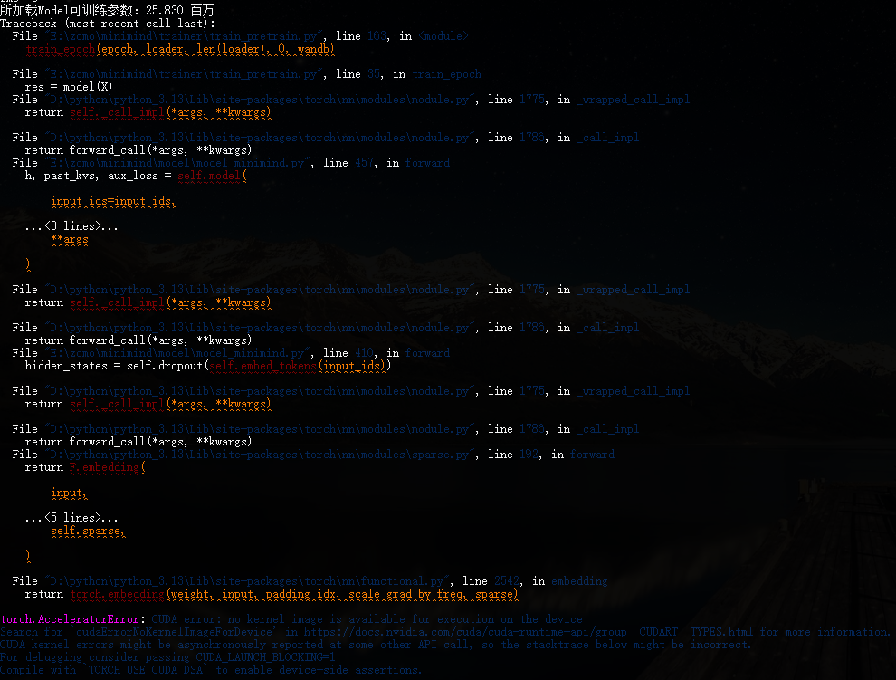

首先是显卡driver、cuda、numpy和troch的版本配套关系，使用版本不配套的软件栈会出现各种各样的奇怪问题，比如没有可用的Nvidia container等等。

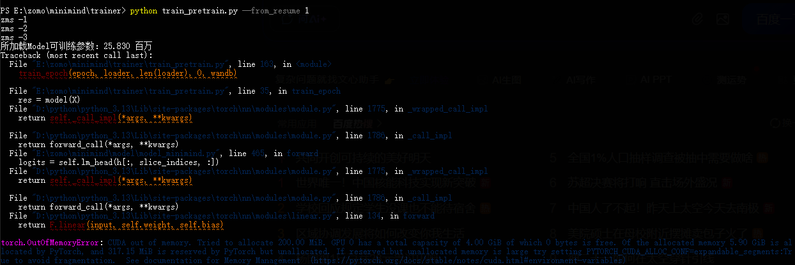

第二，1050ti显卡只有4GB显存，极其容易OOM，刚开始设置模型dim为512、batch为32时，启动即爆显存。

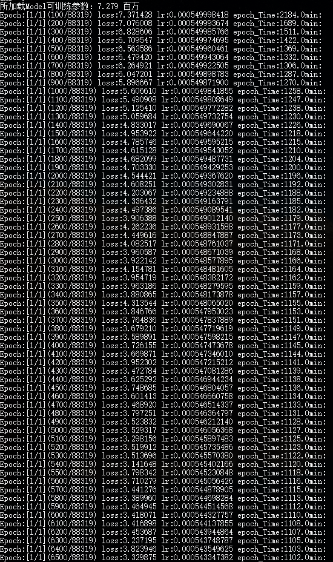

dim调整为256之后，参数规模从26M变成7M，终于不爆显存了，显存占用是3.3GB。
参数规模缩水后，估计训练出来的AI会很智障。我要求不高，只要回答语言通顺就能接受。

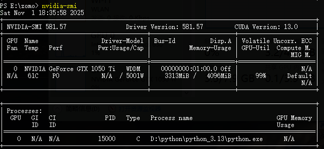
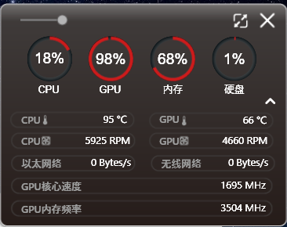

训练过程中，笔记本风扇近6000的转速才能将CPU温度压制在温度墙上，1050Ti的温度倒是不高，只有不到70度。
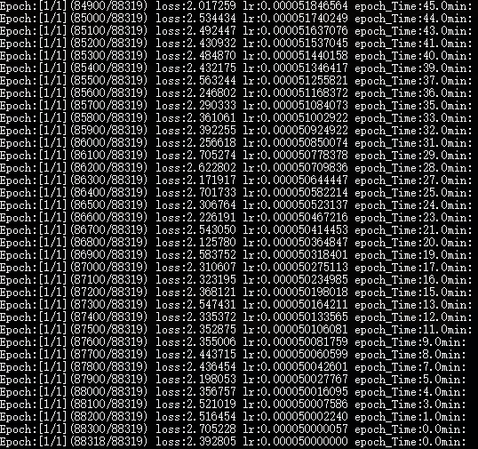

最终，经过18小时的计算，预训练终于完成了。

## 二、模型精调

模型精调训练中，同样遇到了显存不足的问题。比较奇怪的是，dim和batch数值均没有调整，预训练没有问题，精调却不行。

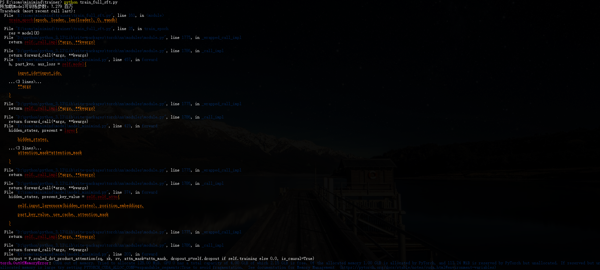

dim已经没有调整的空间了，只能调整batch，把batch调整为16后，依旧没有解决oom问题。

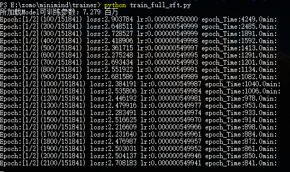

继续调整batch为8，终于解决了oom问题，很奇怪显存只有0.9GB。

按道理讲，照这个显存占用推算即使batch设置为32，也不应该oom才对。

突然想起来一个问题，1050ti好像是没有硬件层面上支持半精度浮点数计算的。
也就是说，训练过程中可能存在bf16转换成fp32的逻辑，也许这是batch 32下oom的原因。

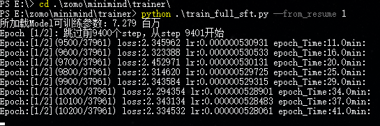

关闭半精度后，使用fp32，batch增加至32，成功的跑了起来，一定程度上验证了之前的猜想。

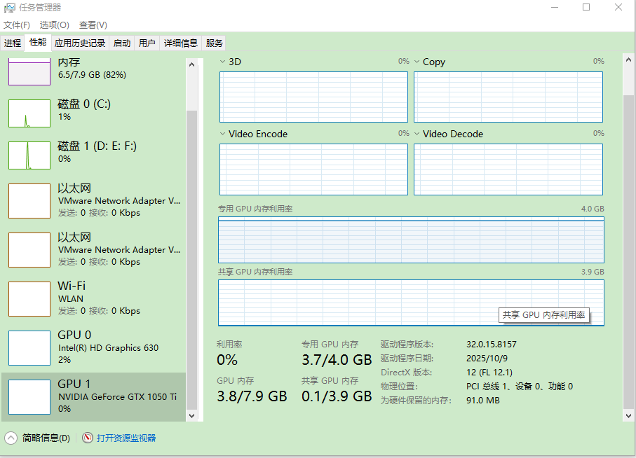

此时，显存占用为3.7GB，正好是batch 8的4倍。

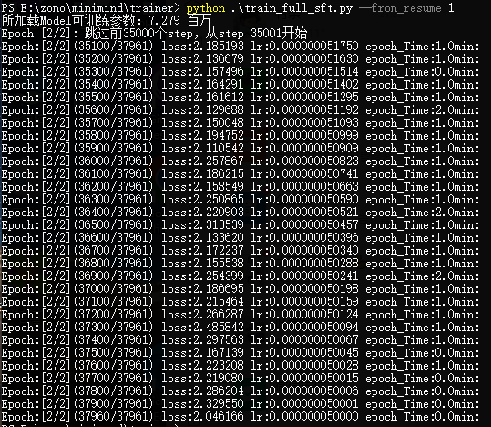

精调的Epoch分为2轮，跑起来之后，第一轮跑了9小时，第二轮是每天跑一点完成的，时间没有仔细记录。

## 三、模型效果测试

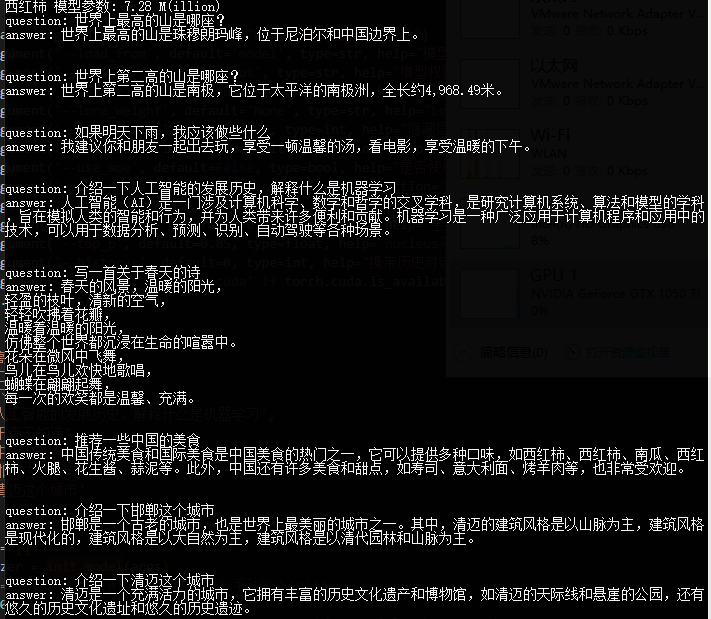

模型训练完了，想了几个问题做了个测试，可以看的出来这个模型挺喜欢吃西红柿的。。
